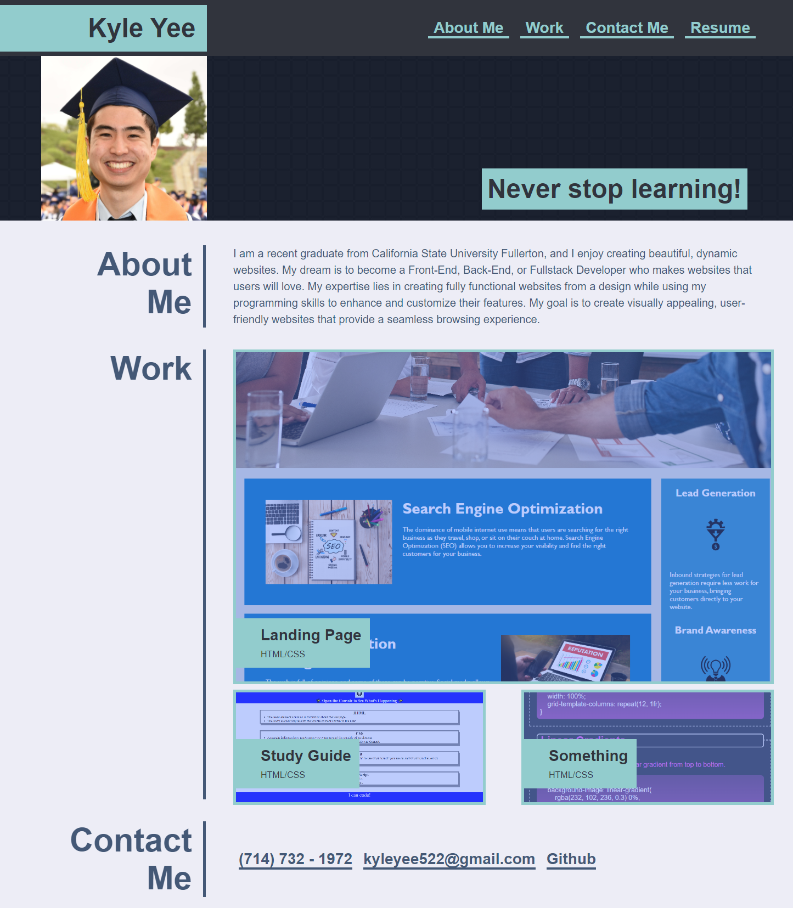

# Portfolio Website

## Description

- This portfolio was created so that I would be able to utilize the advanced HTML and CSS skills that I have learned while also serving as a portfolio website I could use when I start my job search.

- Not only did this challenge help me in building a website from nothing, but it also helped me become more familiar with flexbox, media queries, hover effects, and other CSS skills.

- To view this portfolio website, you can clone this repository or head to: https://kyleyee522.github.io/portfolio-website/

## Assets

The following image is a preview of the portfolio website:

